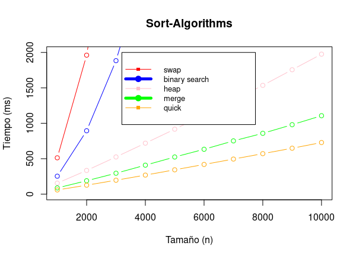

## Comprendiendo como funcionan algunos algoritmos de sorting.

- insertion_sort:
  
  - swaps
  
  - binary_search

- merge_sort

- heap_sort

- quick_sort

El siguiente gráfico muestra el tiempo de ejecución de cada uno de los algoritmos para ciertos tamaños de $n$. 

## Mejoras, Bugs e Ideas Para añadirle.

- Añadir instrucciones de como ejecutar el proyecto.

- El gráfico general obtenido a partir de R no parece ser el más adecuado para el objetivo necesitado que es establecer una comparación entre algunos algoritmos de ordenación.

- Organizar las carpetas dentro de una solución general usando sln.

- Faltan más algoritmos de ordenación.

- Aprender a interpretar los resultados de BenchMarkDotNet en el lenguaje R para poder mejorar la visualización de los resultados.
