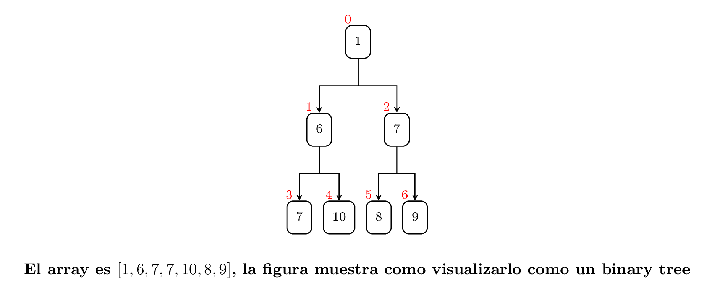

# Heap-Sort:

El heap-sort es un algoritmo de ordenación que se apoya de la estructura **heap**, un heap es una manera de visualizar una lista de objetos como un árbol binario, ahora si a este le añadimos la propiedad de que un nodo ha de ser menor que sus hijos tenemos un **min-heap**: 

Para insertar elementos en este **min-heap** debemos además de ponerlos en el heap, en una posición que no viole las propiedades de este, notemos que la raíz de este árbol es el menor número entre todos, de ahí que el algoritmo de ordenación consiste en poner todos los elementos en el heap, y después extraerlos uno a uno, la operación de insertar tiene un coste logarítmico, al igual que la operación de extraer el menor elemento del **min-heap** puesto que en ambas hay que reajustar los elementos para no violar la propiedad, como son $n$ elementos tenemos un tiempo de ejecución de $0.015 n \log_2{n}$.

| Method | size  | Tiempo | $\frac{Tiempo}{n*\log_2{n}}$ | Allocated [B] |
| ------ | ----- | ------ |:----------------------------:| ------------- |
| heap_1 | 1000  | 155    | 0.015553216442639            | 8480          |
| heap_1 | 2000  | 334.4  | 0.0152474274214808           | 16696         |
| heap_1 | 3000  | 524.7  | 0.015141878118333            | 33105         |
| heap_1 | 4000  | 719.4  | 0.0150303561990946           | 33105         |
| heap_1 | 5000  | 916.7  | 0.0149205966364524           | 65897         |
| heap_1 | 6000  | 1119.8 | 0.0148702970846873           | 65898         |
| heap_1 | 7000  | 1328.5 | 0.0148581888300311           | 65898         |
| heap_1 | 8000  | 1535.4 | 0.0148024211868956           | 65898         |
| heap_1 | 9000  | 1755.9 | 0.0148526429559755           | 131458        |
| heap_1 | 10000 | 1976.2 | 0.014872386935779            | 131459        |
