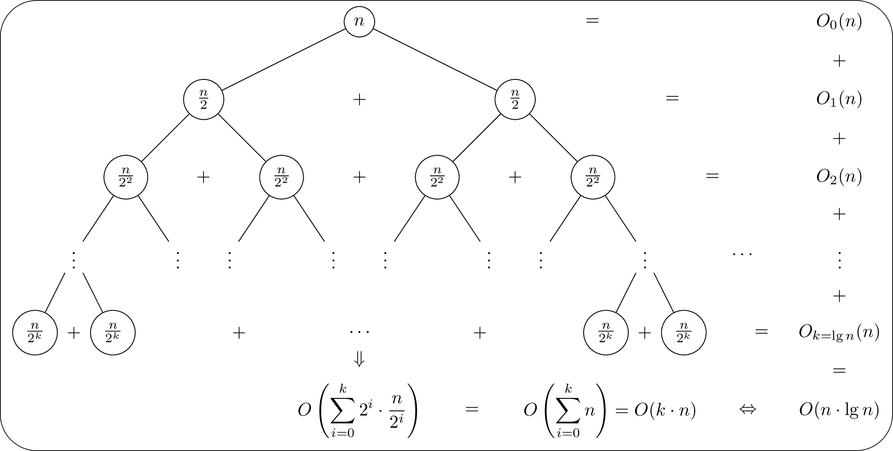

Esta carpeta se refiere al algoritmo de ordenación *Merge-Sort*:

Este es un algoritmo **divide and conquer** de ordenación recursivo que posee una función merge auxiliar para realizar el proceso, consiste en tomar una lista de números, dividirla a la mitad, ordenar cada mitad y finalmente merge ambas mitadas en una lista final ordenada.

Para determinar la complejidad del algoritmo notemos que es lo siguiente:

$T(n) = O(n) + 2*T(\frac{n}{2})$, la solución de esta recurrencia es $n\log_2{n}$ , observar el siguiente Tree:

Sea $m =\log_2{n}$ la parte entera de el logaritmo en base 2 de n, entonces la altura del árbol es $m+1$ y tiene $2^m$ leaves, notemos que en cada nivel del árbol el trabajo hecho es cn donde cn representa el $O(n)$ realizado por la función merge. Esto es un análisis 

Podemos ver que obtenemos un tiempo de ejecución de $0.008n\log_2{n}$

| Method  | Tamaño | Tiempo  | $\frac{Tiempo}{n \log_2{n}}$ | Memoria Usada (Bytes) |
|:-------:| ------ | ------- |:----------------------------:| --------------------- |
| merge_1 | 1000   | 87.53   | 0.00878305184015609          | 96296                 |
| merge_1 | 2000   | 188.85  | 0.008610875204984            | 200648                |
| merge_1 | 3000   | 294.78  | 0.00850680928477646          | 312552                |
| merge_1 | 4000   | 408.89  | 0.00854290011988853          | 417352                |
| merge_1 | 5000   | 524.1   | 0.00853047310697578          | 535977                |
| merge_1 | 6000   | 633.21  | 0.00840866299070804          | 649161                |
| merge_1 | 7000   | 751.47  | 0.00840457896883962          | 761385                |
| merge_1 | 8000   | 858.27  | 0.00827437412535944          | 866761                |
| merge_1 | 9000   | 980.23  | 0.00829147799119302          | 990314                |
| merge_1 | 10000  | 1107.19 | 0.00833243502248008          | 1112010               |
